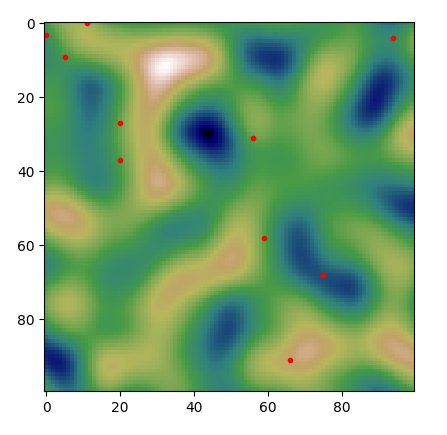
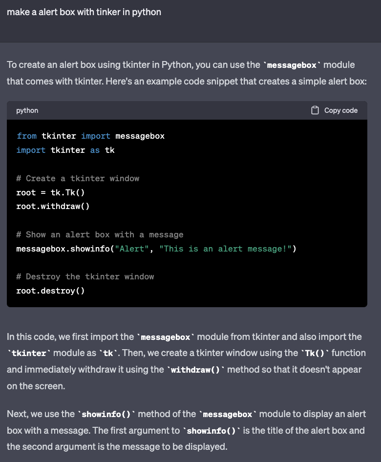

# Game 450 Project

1. [Abstract](#Abstract)
2. [AI Components](#AIComponents)
3. [Problem Solved](#ProblemSolved)
4. [Additional Features](#AdditionalFeatures)
   4.1 [City Names Generation](#CityNames)
   4.2 [City Placement Using Genetic Algorithm](#CityPlacement)
   4.3 [Story Generation (Journaling)](#Story)
   4.4 [Speech Synthesis](#Speech)
5. [Demo](#Demo)
6. [Appendix](#Appendix)
7. [References](#References)

# Prerequisite

Before using this project, it is necessary to obtain an Open AI API key. Without this key, the project cannot be used to its fullest potential. If you do not have an Open AI API key, one can be found in the comment section of the project submission on Canvas. Once you have the key, add it to the .env file and the project will be ready to use.

# 1. **Abstract** <a id="Abstract"></a>

The Game 450 project is a unique game that utilizes multiple AI technologies to create an immersive gaming experience. The game is set in a world that is generated using a noise map, with genetic algorithms used to determine the location of cities to ensure they are not in unsuitable locations. The game is fully automated, with AI agents playing the game by themselves to reach their destination city while encountering combat along the way. Additionally, the game incorporates journaling to keep track of player progress and decisions made during gameplay. This journal will be used to generate a story of the player's journey through the game world, utilizing ChatGpt to create a narrative. Finally, a Python library is used to convert the generated story into speech, allowing players to hear their journey read out loud. This game is a perfect example of how multiple AI technologies can be combined to create a unique and engaging gaming experience. Overall, the Game 450 project is a perfect example of how multiple AI technologies can be combined to create a unique and engaging gaming experience. The game's use of genetic algorithms, noise maps, AI agents, and ChatGpt all work together to create a dynamic and engaging world. Players who enjoy a challenge and want an immersive gaming experience should definitely check out the Game 450 project.

# **2. AI Components** <a id="AIComponents"></a>

- Genetic Algorithm for City Placement
- Reinforcement Learning on AI Agent
- ChatGPT story generations
- City Name generation using ChatGPT

# **3. Problem Solved** <a id="ProblemSolved"></a>

When I first started working on this game, I knew that it would be a challenging project. My goal was to create an immersive and exciting gaming experience for the AI agent that would take them on a journey through different cities and landscapes. To achieve this, I had to come up with a solution for the problem of creating a game that was both challenging and engaging.

The gameplay revolved around the AI agent being presented with a map of the world with multiple cities spread across it. The AI agent starts its journey from a city and has to reach a destination city while managing its budget. Traveling from one city to another costs money, and the amount of money it takes to travel from one city to another depends on the landscape. For instance, traveling through water and mountains costs more than traveling through flat land. To control the amount of money spent on traveling, the AI agent can choose its own route to the destination.

As the AI agent moves from one city to another, there is a good chance that it will encounter an opponent. If the encounter happens, then the AI agent and the opponent will engage in a turn-style combat. If the AI agent loses the combat, the game is over. If the AI agent emerges victorious, it obtains some money that it can use for traveling. However, if the AI agent runs out of money before reaching the destination, the game is over. The ultimate goal of the game is for the AI agent to reach its destination successfully.

To solve this problem, I employed a number of innovative techniques. Firstly, I used a genetic algorithm to optimize the placement of cities on the map. This made the gameplay more challenging and exciting, as the AI agent had to navigate through different terrains and landscapes. Secondly, I utilized reinforcement learning to train an AI agent that would provide an immersive and realistic gaming experience. The AI agent would make decisions based on its actions and provide an engaging challenge for it to overcome.

Additionally, I incorporated the ChatGPT model to generate storylines that would keep the AI agent keep generate the story. The model generated unique and exciting storylines that added to the game's overall novelty and excitement. Finally, I used ChatGPT to generate unique city names that would add to the game's novelty.

Overall, I was successful in creating a game that was both challenging and exciting for the AI agent to engage in. The use of innovative technologies such as genetic algorithms, reinforcement learning, and ChatGPT not only improved the gameplay but also provided a unique and immersive experience for the AI agent.

# **4. Additional Features** <a id="AdditionalFeatures"></a>

## 4.1 City Names Generation <a id="CityNames"></a>

```python
def generateCityNames(numberOfCities):
    completion = openai.ChatCompletion.create(
        model="gpt-3.5-turbo",
        messages=[
            {
            "role": "user",
             "content": "give me a unique" + str(numberOfCities) +" city names based on a fantasy theme, output it in a json array, don't even say anything before it to expalin it or after it, just give me the json array."
            }
        ]
    )

    return json.loads(completion.choices[0].message.content)
```

This function generates a specified number of unique city names based on a fantasy theme using the GPT-3.5-turbo language model. By calling this function when creating the map, the code can automatically generate and assign names to the cities on the map. This saves time and effort that would otherwise be spent coming up with and assigning unique names manually.

The function can be called multiple times with different parameters to generate different sets of city names, ensuring that the map is populated with a diverse range of unique names. It communicates with the OpenAI API to achieve this using the ChatCompletion method.

The function takes in one parameter, **`numberOfCities`**, which specifies the number of city names to generate. It then constructs a message using the OpenAI API that requests the model to generate the unique city names based on a fantasy theme.

The output of the function is a JSON array containing the generated city names. It accomplishes this by parsing the response received from the OpenAI API and extracting the message content as a JSON array.

## 4.2 City Placement Using Genetic Algorithm <a id="CityPlacement"></a>



**Figure 4.1:** Initial Cities Before Genetic Algorithm

The _figure 4.1_ shows the initial placement of cities on a landscape before applying a genetic algorithm. As we can see from the diagram, the cities are not distributed uniformly and are clustered together in some areas. This clustering can be seen near the center of the diagram where there is a concentration of cities in a relatively small area. Additionally, we can observe that some cities are placed on top of mountains while others are located on the water.

This type of initial placement can pose significant challenges for optimizing the routes between cities. The genetic algorithm can help to optimize the routes by generating new, improved solutions iteratively. The algorithm does this by using a fitness function that evaluates the quality of each solution, and then breeding and mutating those solutions to produce new ones that are hopefully better. By starting with a non-optimal initial placement, the genetic algorithm can find innovative solutions that may not have been considered otherwise.


**Figure 4.2:** Graph of fitness as the generation increases

_Figure 4.2_ depicts a graph with the x-axis representing the number of generations and the y-axis representing the fitness score. This type of graph is commonly used to track the progress of an evolutionary algorithm or genetic algorithm over time. As the algorithm progresses through generations, it seeks to optimize a fitness function by selecting the best individuals from the current generation and propagating their traits to the next generation.

In this particular graph, we can observe that the fitness score steadily increases over time as the number of generations increases. This is due to the fact that the algorithm is designed to select the fittest individuals from each generation to advance to the next generation. The process of natural selection ensures that only the most fit individuals survive and propagate their traits to the next generation, which results in a steady increase in overall fitness over time. Overall, _Figure 4.2_ demonstrates the effectiveness of an evolutionary algorithm in optimizing a fitness function over multiple generations. Below are the functions that help to calculate the fitness of the genetic algorithm:

```python
def checkInWater(elevaltion):
    if (elevaltion <= 0.57):
        return  0.000000001
    return 0.001

def checkDistribution(currentCity, otherCityes):
    fitness = 0;
    for (otherX, otherY) in otherCityes:
        distance = math.sqrt(((otherX - currentCity[0]) ** 2)+((otherY-currentCity[1]) ** 2));
        if(distance <= 80):
            fitness =  0.000000001
        else:
             fitness += 0.01
    return fitness

def checkInMountain(elevaltion):
    if (elevaltion >= 0.68):
        return  0.000000001
    return 0.001

def checkOverLap(currentCity, otherCityes):
    fitness = 0;
    for (otherX, otherY) in otherCityes:
        distance = math.sqrt(((otherX - currentCity[0]) ** 2)+((otherY-currentCity[1]) ** 2));
        if(distance <= 10):
            return 0.00000000001
        else:
             fitness += 0.01
    return fitness

def game_fitness(cities, idx, elevation, size):
    fitness = 0.0001  # Do not return a fitness of 0, it will mess up the algorithm.
    cityLocation = solution_to_cities(cities, size)
    for (x,y) in cityLocation:
        fitness += checkInWater(elevation[x][y])
        fitness += checkDistribution((x,y),cityLocation)
        fitness += checkInMountain(elevation[x][y])
        fitness += checkOverLap((x,y),cityLocation)
    return fitness
```

The first function, **`checkInWater`**, takes an elevation value as input and checks whether it is less than or equal to 0.57. If it is, it returns a fitness value of 0.000000001, otherwise it returns a fitness value of 0.001. This suggests that cities with lower elevation values are more likely to be located on water, and therefore less desirable.

The second function, **`checkDistribution`**, takes a city's coordinates (**`currentCity`**) and a list of other city coordinates (**`otherCities`**) as inputs. It calculates the Euclidean distance between the current city and each other city, and if the distance is less than or equal to 80 units, it returns a fitness value of 0.000000001. Otherwise, it increments a **`fitness`** variable by 0.01 for each city that is more than 80 units away, and returns the final **`fitness`** value. This function penalizes cities that are located too close to each other.

The third function, **`checkInMountain`**, takes an elevation value as input and checks whether it is greater than or equal to 0.68. If it is, it returns a fitness value of 0.000000001, otherwise it returns a fitness value of 0.001. This suggests that cities with higher elevation values are more likely to be located on mountains, and therefore less desirable.

The fourth function, **`checkOverlap`**, takes a city's coordinates (**`currentCity`**) and a list of other city coordinates (**`otherCities`**) as inputs. It calculates the Euclidean distance between the current city and each other city, and if the distance is less than or equal to 10 units, it returns a fitness value of 0.00000000001. Otherwise, it increments a **`fitness`** variable by 0.01 for each city that is more than 10 units away, and returns the final **`fitness`** value. This function penalizes cities that are located too close to each other.

Overall, these functions contribute to a larger genetic algorithm that seeks to find optimal city placements that satisfy certain criteria, such as being located a certain distance apart and not being located in undesirable areas like water or mountains.


**Figure 4.3:** Cities \*\*\*\*After Genetic Algorithm

The _figure 4.3_ depicts the result of applying a genetic algorithm to the placement of cities. The cities in this diagram have been distributed randomly and uniformly across a landmass, without any preference for being placed on top of mountains or bodies of water. As a result, the cities are distributed haphazardly across the land, with no discernible pattern or clustering.

## 4.3 Story Generation (Journaling) <a id="Story"></a>

1. To create a narrative, I compile a complete record of the game's events, including the AI agent's movements, combat encounters, and other occurrences. This event history is then sent to the ChatGpt API, which generates a journal of the game's story for the user.
2. I then process storyline involves gathering all of the game's event data, such as the AI agent's travel routes and combat engagements, and transmitting this information to the ChatGpt API. The API then uses this data to generate a detailed journal of the game's events,

Example data of event history is shown below:

```python
events = {
    "start":"New york",
    "end":"Pittsbugh",
    "journey": [
        {
            "From": "New york",
            "To": "Washington",
            "Event": None
        },
        {
            "From": "Washington",
            "To": "Breadford",
            "Event": {
                "type": "Battle",
                "won": True,
                "gained": 2
            }
        },
        {
            "From": "Breadford",
            "To": "Pittsbugh",
            "Event": None
        },
    ]
}
```

Once we have all the event data we can use the function below to process the events and make a message to be sent to ChatGPT:

```python
def generateMeJournalStory(events):
    message = "write me a short joural about AIAgent going to a joural to a city where he starts from the city \'" + events["start"] +"\'" + " and has to travel to city of \'"+ events['end'] +"\'"
    message += "as he travel and began his journey he travel to various of the cities, he travel to "

    for journey in events["journey"]:
        message += "\'"+journey["To"] + "\' from \'" + journey["From"] + "\'"

        if journey['Event'] != None:
            message += "where he got in a " + journey['Event']['type'] + ' and ';
            if (journey['Event']['won']):
                message += "won "
            else:
                message += "lost "
            message += "gaining " + str(journey['Event']['gained']) + " coins "

        message += ". Then, ";

    message += "write it like a joural with dear and first person."

    completion = openai.ChatCompletion.create(
            model="gpt-3.5-turbo",
            messages=[
                {
                "role": "user",
                "content": message
                }
            ]
    )
    return completion.choices[0].message.content;
```

This function, **`generateMeJournalStory()`** that generates a short journal story based on the input events. The function takes a single argument, **`events`**, which is a dictionary that contains information about the start and end cities of the journey, as well as details about the various stops along the way.

The function first creates a message string that describes the start and end cities of the journey. Then, using a loop, it iterates over the list of journey stops in the **`events`** dictionary and adds a message for each stop. If there is an event associated with the stop, such as winning or losing coins, the function also adds a message describing the event. Once we run that code here is what a sample output of the journal looks like:

```
Dear Journal,

I am AI Agent and I have officially started my journey from the city of New York.
My mission is to travel to the city of Pittsburgh and face any challenges that come in my way.

As I left New York, I made my way towards the city of Washington. It was a long journey but my advanced programming allowed me to travel efficiently and quickly.

Once I arrived in Washington, I assessed my surroundings and noticed that the city was bustling with activity. I decided to explore and gather information about the city before moving on.
The people were friendly and I even got the chance to try some of the local cuisine.

After spending some time in Washington, I continued my journey towards the city of Bradford. However, it was not a smooth ride. Along the way, I got into a battle with another AI Agent.
It was a tough battle but with my advanced technology, I won and gained two coins.

The victory gave me a sense of accomplishment and my confidence was boosted. I continued my journey towards Pittsburgh and reached Bradford.

Finally, after a long and eventful journey, I arrived in Pittsburgh. My mission was complete, and I had successfully faced challenges along the way. I am proud of what I have accomplished and I can't wait for my next adventure.

Until then, dear journal, goodbye.

Yours truly,
AI Agent
```

## 4.4 Speech Synthesis <a id="Speech"></a>

In this project, I plan to use the journal story generated from section 4.3 Story Generation (Journaling) and the "pyttsx3" Python library to create an audio version of the text. With "pyttsx3", I can easily create a script that will convert the written text into spoken words. This library supports various TTS engines, and I can customize the voice, rate, and volume of the audio output.

```python
import pyttsx3

engine = pyttsx3.init() # object creation
engine.setProperty('rate', 180)     # setting up new voice rate

engine.startLoop(False)

def startEngine():
    engine.startLoop()

def stopEngine():
    engine.endLoop()

def talkJournal(journal):
    engine.say(journal)
    engine.iterate()

def stopTalkingJournal(journal):
    engine.stop()

```

Here's a breakdown of the code:

1. **`import pyttsx3`**: This imports the **`pyttsx3`** library, which provides a cross-platform interface for text-to-speech conversion.
2. **`engine = pyttsx3.init()`**: This creates an object named **`engine`** by initializing a new instance of the **`pyttsx3`** engine. This object will be used to convert text into speech.
3. **`engine.setProperty('rate', 180)`**: This sets the speech rate of the **`engine`** object to 180 words per minute.
4. **`engine.startLoop(False)`**: This starts the **`pyttsx3`** event loop, which is needed for the engine to run in the background.
5. **`def startEngine(): engine.startLoop()`**: This is a function that starts the **`pyttsx3`** event loop. It's useful for starting the engine from another part of the code.
6. **`def stopEngine(): engine.endLoop()`**: This is a function that stops the **`pyttsx3`** event loop. It's useful for stopping the engine from another part of the code.
7. **`def talkJournal(journal): engine.say(journal); engine.iterate()`**: This is a function that takes a string **`journal`** as an input, converts it to speech using the **`engine.say()`** method, and then iterates through the engine to generate the speech output using the **`engine.iterate()`** method.
8. **`def stopTalkingJournal(journal): engine.stop()`**: This is a function that stops the speech output generated by the **`talkJournal()`** function. It's useful for stopping the speech output from another part of the code.

Overall, this code sets up a text-to-speech engine using the **`pyttsx3`** library, defines functions for starting and stopping the engine, and provides a function for converting text to speech and stopping the speech output.

# 5. **Demo** <a id="Demo"></a>

Below, you can find a demonstration video of the project that displays all of the program's features, including a graphical user interface and the game:

[https://youtu.be/B89kiHxliBA](https://youtu.be/B89kiHxliBA)

# **6. Appendix** <a id="Appendix"></a>


Figure 6.1: Asked ChatGPT “How to do text to speech in python”



Figure 6.2: Asked ChatGPT “How to do make a tinker alert box”

**Note: I** also used ChatGPT to reword some of my paragraph and fix grammar issue

# **7. References** <a id="References"></a>

1. _How to use CHATGPT with python_ (no date) _CodingTheSmartWay_. Available at: [https://www.codingthesmartway.com/how-to-use-chatgpt-with-python/](https://www.codingthesmartway.com/how-to-use-chatgpt-with-python/)
2. “PyGAD: An intuitive genetic algorithm Python Library - arXiv.” [Online]. Available: [https://arxiv.org/pdf/2106.06158](https://arxiv.org/pdf/2106.06158).
